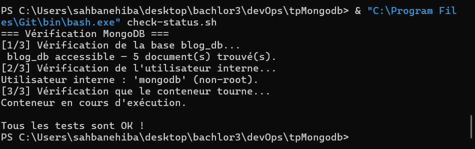

# TP MongoDB Docker — Blog DB

Image Docker MongoDB 6.0 préconfigurée avec une base `blog_db` et un validateur de schéma.

## Image Docker Hub
https://hub.docker.com/r/hibasahbane/sahbanehibamongo

## Lancer le conteneur
```bash
docker run -d --name mongo_container --env-file .env -p 27017:27017 hibasahbane/sahbanehibamongo:1.0.0
```


## Preuves de fonctionnement

### check-status.sh


### Insertion invalide rejetée


### Insertion docker ps

